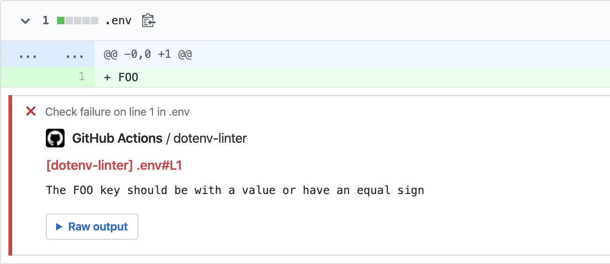
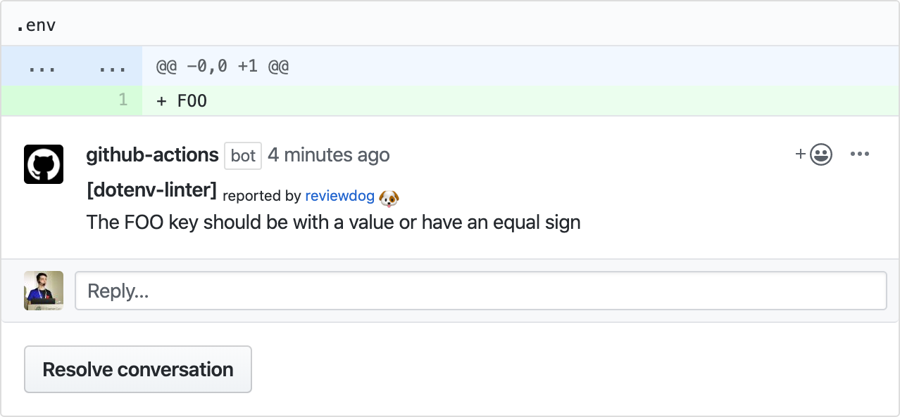
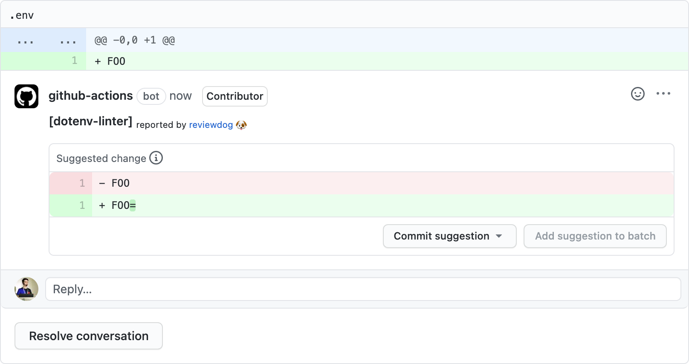

# GitHub Action: Run dotenv-linter with reviewdog 🐶

[](https://github.com/dotenv-linter/action-dotenv-linter/actions?query=workflow%3ACI)
[](./LICENSE)
[](https://github.com/dotenv-linter/action-dotenv-linter/actions?query=workflow%3Adepup)
[](https://github.com/dotenv-linter/action-dotenv-linter/actions?query=workflow%3Arelease)
[](https://github.com/dotenv-linter/action-dotenv-linter/releases)
[](https://github.com/haya14busa/action-bumpr)

This action runs [dotenv-linter](https://github.com/dotenv-linter/dotenv-linter) with
[reviewdog](https://github.com/reviewdog/reviewdog) on pull requests to lint `.env` files.

## Examples

### With `github-pr-check`

By default, with `reporter: github-pr-check` an annotation is added to the line:



### With `github-pr-review`

With `reporter: github-pr-review` a comment is added to the Pull Request Conversation:



### With `github-code-suggestions`

With `reporter: github-code-suggestions` a code suggestion is added to the Pull Request Conversation:



## Inputs

### `github_token`

**Required**. Must be in form of `github_token: ${{ secrets.github_token }}`.

### `dotenv_linter_flags`

Optional. `dotenv-linter` flags. (`dotenv-linter <dotenv_linter_flags>`)

### `tool_name`

Optional. Tool name to use for reviewdog reporter. Useful when running multiple
actions with different config.

### `reporter`

Optional. Reporter of reviewdog command [`github-pr-check`, `github-pr-review`, `github-code-suggestions`].
The default is `github-pr-check`.

### `filter_mode`

Optional. Filtering mode for the reviewdog command [`added`, `diff_context`, `file`, `nofilter`].
Default is `added`.

### `fail_on_error`

Optional.  Exit code for reviewdog when errors are found [`true`, `false`]
Default is `false`.

### `reviewdog_flags`

Optional. Additional reviewdog flags.

## Simple check example

```yml
name: dotenv
on: [pull_request]
jobs:
  dotenv-linter:
    name: runner / dotenv-linter
    runs-on: ubuntu-latest
    steps:
      - uses: actions/checkout@v2
      - name: Run dotenv-linter
        uses: dotenv-linter/action-dotenv-linter@v2
        with:
          github_token: ${{ secrets.github_token }}
          reporter: github-pr-review # Default is github-pr-check
          dotenv_linter_flags: --skip UnorderedKey
```

## Code suggestions example

```yml
name: dotenv
on: [pull_request]
jobs:
  dotenv-linter:
    name: runner / dotenv-linter
    runs-on: ubuntu-latest
    steps:
      - uses: actions/checkout@v2
      - name: Run dotenv-linter with code suggestions
        uses: dotenv-linter/action-dotenv-linter@v2
        with:
          github_token: ${{ secrets.github_token }}
          reporter: github-code-suggestions
```

## Sponsor

<p>
  <a href="https://evrone.com/?utm_source=action-dotenv-linter">
    
  </a>
</p>

## License

[MIT](https://choosealicense.com/licenses/mit)
