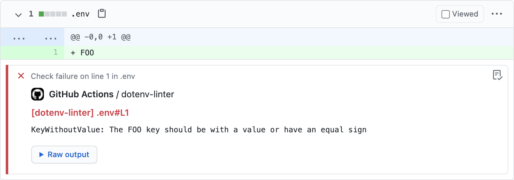
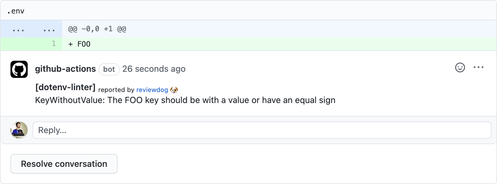

# GitHub Action: Run dotenv-linter with reviewdog 🐶


This action runs [dotenv-linter](https://github.com/mgrachev/dotenv-linter) with
[reviewdog](https://github.com/reviewdog/reviewdog) on pull requests to lint `.env` files.

## Examples

### With `github-pr-check`

By default, with `reporter: github-pr-check` an annotation is added to the line:



### With `github-pr-review`

With `reporter: github-pr-review` a comment is added to the Pull Request Conversation:



## Inputs

### `github_token`

**Required**. Must be in form of `github_token: ${{ secrets.github_token }}`'.

### `dotenv_linter_flags`

Optional. `dotenv-linter` flags. (`dotenv-linter <dotenv_linter_flags>`)

### `tool_name`

Optional. Tool name to use for reviewdog reporter. Useful when running multiple
actions with different config.

### `level`

Optional. Report level for reviewdog [`info`, `warning`, `error`].
It's same as `-level` flag of reviewdog.

### `reporter`

Optional. Reporter of reviewdog command [`github-pr-check`, `github-pr-review`].
The default is `github-pr-check`.

## Example usage

```yml
name: reviewdog
on: [pull_request]
jobs:
  dotenv-linter:
    name: runner / dotenv-linter
    runs-on: ubuntu-latest
    steps:
      - name: Check out code
        uses: actions/checkout@v1
      - name: dotenv-linter
        uses: mgrachev/action-dotenv-linter@v1
        with:
          github_token: ${{ secrets.github_token }}
          reporter: github-pr-review # Default is github-pr-check
```

## Sponsor

<p>
  <a href="https://evrone.com/?utm_source=action-dotenv-linter">
    
  </a>
</p>

## License

[MIT](https://choosealicense.com/licenses/mit)
